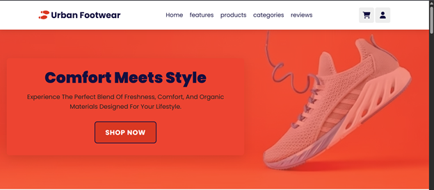
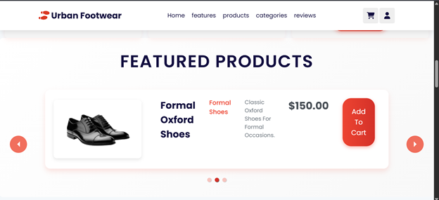
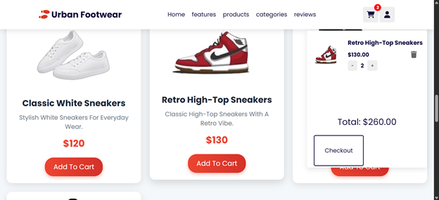

# Shoe Website

[](LICENSE)

A responsive, single‑page e‑commerce frontend for Urban Footwear built with React and Vite. Browse featured shoes, add them to your cart, and checkout—all while enjoying fast load times and a mobile‑first design.

---

## Table of Contents

1. [Demo](#demo)  
2. [Features](#features)  
3. [Tech Stack & Prerequisites](#tech-stack--prerequisites)  
4. [Getting Started](#getting-started)  
   - [Clone & Install](#clone--install)  
   - [Available Scripts](#available-scripts)  
5. [Project Structure](#project-structure)  
6. [Usage](#usage)  
7. [Contributing](#contributing)  
8. [License](#license)  
9. [Author](#author)  

---

## Demo

  
  
 


---

## Features

1. **Responsive Design**  
   - Mobile-first UI that adapts seamlessly from phones to large desktops.

2. **Product Showcase**  
   - Interactive carousel powered by `react-responsive-carousel`.  
   - Data loaded from local JSON files in `/src/data`.

3. **Shopping Cart**  
   - Add, remove, and update quantities with a single click.  
   - Persists across page reloads via `localStorage`.

4. **Checkout Flow**  
   - Simple form collects name, address, and email.  
   - Order confirmation popup on submit.

5. **Scalable Architecture**  
   - Hooks & Context API for state management.  
   - Modular CSS per component for maintainability.

---

## Tech Stack & Prerequisites

- **React** v18.3.1  
- **Vite** v4.3.4 (build tool with lightning‑fast HMR)  
- **react-responsive-carousel** v3.2.23  
- **react-router-dom** v7.5.0  
- **Node.js** ≥16.x & **npm** ≥8.x

---

## Getting Started

### Clone & Install

```bash
# Clone the repo
git clone https://github.com/<your-username>/shoe-website.git
cd shoe-website

# Install dependencies
npm install
```

### Available Scripts

| Script         | Description                                    |
| -------------- | ---------------------------------------------- |
| `npm run dev`  | Start Vite development server (http://localhost:5173) |
| `npm run build`| Build for production into `dist/`              |
| `npm run preview` | Preview the production build locally        |
| `npm run lint` | Run ESLint across all source files             |

---

## Project Structure

```
shoe-website/
├─ public/                  # Static assets & images
├─ src/
│  ├─ assets/               # Banners, feature images, logos
│  ├─ components/
│  │  ├─ Header/            # Navbar & logo
│  │  ├─ Home/              # Landing page content
│  │  ├─ FeaturedProductsCarousel/
│  │  ├─ ProductPage/
│  │  ├─ DetailedProductPage/
│  │  ├─ Reviews/
│  │  ├─ Footer/
│  │  └─ (…)
│  ├─ data/                 # `featured-products.json`, `products.json`, `reviews.json`
│  ├─ App.jsx
│  ├─ main.jsx
│  └─ index.css
├─ eslint.config.js
├─ index.html
├─ package.json
└─ vite.config.js
```

---

## Usage

1. **Start Dev Server**  
   ```bash
   npm run dev
   ```
2. **Build for Production**  
   ```bash
   npm run build
   ```
3. **Preview Production Build**  
   ```bash
   npm run preview
   ```

---


## License

This project is licensed under the [MIT License](LICENSE).

---
